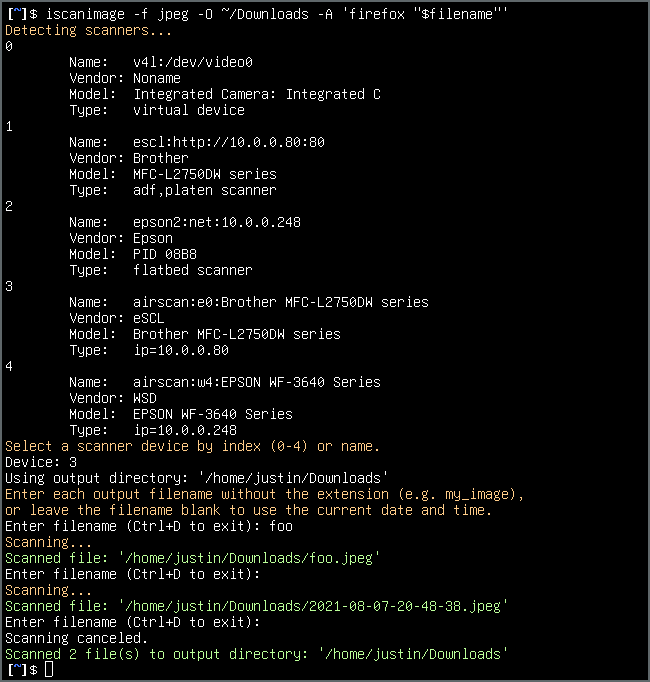

# iscanimage

`iscanimage` is an user-friendly command line program for operating scanner devices in Linux. It uses `scanimage` to do the actual scanning, as the name implies, but it adds many quality-of-life improvements for interactive use.

## Features

* Select a scanner device interactively
* Scan multiple files in one session
* Save all scanned files to a specified directory
* Name each file as you go (defaults to the current date and time)
* Evaluate custom commands before and after scanning each file

## Installation

Download the [iscanimage](iscanimage) script, make it executable, and drop it somewhere on your `$PATH`.

## Usage

Here's an example user session:

Try `iscanimage --help` for more details.

## To Do

* Create a proper manpage

## License

`iscanimage` is licensed under the [MIT License](LICENSE.md).
